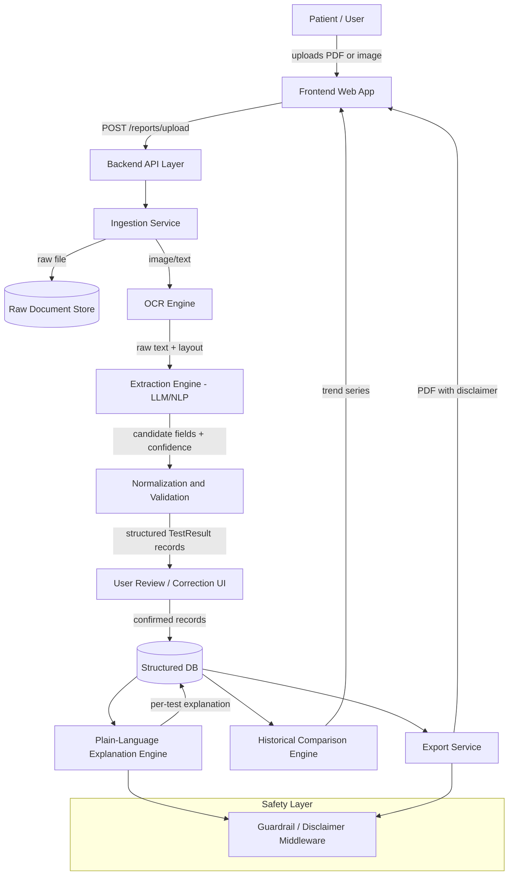

# System Design — AI-Powered Medical Report Simplifier (H2)

## 1. Problem Understanding

**Problem statement (as given):** Build a system that converts complex medical reports into a
simpler, structured explanation for patients. Extract important fields from uploaded sample
reports and present them clearly **without attempting to provide a medical diagnosis**.

**Suggested scope:**
- Document/image upload and OCR
- Extraction of test names, values, units and dates
- Plain-language explanation
- Historical comparison of selected values
- Exportable summary and medical disclaimer

**Reading between the lines of the scope:** the hard part of this problem is not "call an LLM
on a PDF." It is:
1. Reliably turning a messy scanned/photographed lab report into **structured, trustworthy
   data** (OCR is noisy; lab report layouts are wildly inconsistent).
2. Explaining that data in plain language **without crossing the line into diagnosis** — this
   is a safety-critical constraint, not a nice-to-have, and judges will likely test it directly
   (e.g. "what disease do I have?").
3. Tracking the same test across multiple reports over time (a "cholesterol" from Report A has
   to be recognized as the same measurand as "Total Cholesterol" from Report B, in possibly
   different units) — this is a data-normalization problem, not just a UI feature.
4. Being honest about uncertainty — OCR misreads and extraction misses will happen, and the
   system's credibility depends on surfacing that rather than presenting numbers with false
   confidence.

## 2. Goals and Non-Goals

**Goals**
- Ingest a scanned/photographed/PDF lab report and extract test name, value, unit, reference
  range, and report date for each result.
- Translate each result into a short, plain-language explanation a non-clinical patient can
  understand (what the test measures, and whether the value sits inside/outside the reported
  reference range — described neutrally, not diagnostically).
- Let a patient see how a given test (e.g. HbA1c, LDL) has moved across multiple uploaded
  reports over time.
- Produce a clean, exportable (PDF) summary that includes a visible medical disclaimer.
- Be transparent about extraction confidence and let the user correct misread fields before
  anything is stored or explained.

**Explicit non-goals**
- No diagnosis, risk prediction, or treatment/medication advice, in any form, including
  implied severity language ("this is dangerous", "you should worry").
- No claim to replace a doctor; every output funnels back to "discuss this with your
  clinician."
- No attempt to support every lab format in the world for a hackathon MVP — target common,
  representative formats (CBC, lipid profile, thyroid panel, liver function, kidney function)
  and design the extraction layer so new formats are a config/prompt change, not a rewrite.
- No permanent, unconsented storage of medical data beyond what's needed to demo history —
  storage should be explicit, user-owned, and deletable.

## 3. High-Level Architecture

**Why this shape:** every stage that touches patient data (OCR → extraction → normalization)
is separated from the stage that generates *language* (explanation). This keeps the "did we
read the number right" problem (a data problem, testable with precision/recall) cleanly apart
from the "did we explain it safely" problem (a language-safety problem, testable with a
guardrail checklist). Judges evaluating "no diagnosis" will be looking specifically at the
explanation layer, so it needs to be small, inspectable, and independently testable.

## 4. Component Breakdown

### 4.1 Frontend (Web App)
- **Upload screen** — drag/drop or camera capture, accepts PDF/JPG/PNG, shows upload progress.
- **Review & correct screen** — shows the extracted table (test, value, unit, range, date)
  next to the original document image, with every field editable before confirming. This is
  the trust-building step: the system never silently "decides" a number is right.
- **Explanation view** — per-test plain-language card: what it measures, the patient's value,
  whether it falls inside/outside the reference range, in neutral descriptive language.
- **History/trends view** — line chart per test across all uploaded reports for that patient
  profile, with the underlying values in a table below the chart.
- **Export view** — generates and downloads a PDF summary; disclaimer is always visible, not
  just on export.

### 4.2 Backend API Layer
Thin REST layer that authenticates the session, orchestrates the pipeline, and exposes CRUD
for report records. Stateless where possible so the pipeline stages can be scaled/replaced
independently (e.g. swapping OCR engines later doesn't touch the API contract).

### 4.3 Ingestion Service
- Validates file type/size, stores the raw file, and routes images straight to OCR while
  routing text-based PDFs to direct text extraction (skipping OCR when the PDF already has a
  text layer — faster and more accurate than OCR when available).

### 4.4 OCR Engine
- For scanned/photographed input: an OCR engine (see §6) converts the image to raw text while
  preserving rough layout/line structure, since lab reports are tabular and layout is a strong
  extraction signal.
- Applies basic image pre-processing (deskew, contrast normalization) to improve OCR accuracy
  on phone-camera photos, which is the realistic input for a patient-facing tool.

### 4.5 Extraction Engine
- Takes raw OCR/PDF text and produces a structured list of candidate results:
  `{test_name, value, unit, reference_range, flag (H/L/normal if the report states it), date}`.
- Uses an LLM with a strict, schema-constrained prompt (see §7) rather than pure regex, because
  lab report layouts vary too much for hand-written parsers to generalize — but pairs the LLM
  output with a confidence score per field and flags anything the model isn't sure about for
  human review.
- Emits a **per-field confidence score**, not just a per-report one, since a single report
  might have nine clean rows and one garbled one.

### 4.6 Normalization & Validation Layer
- Maps free-text test names to a canonical test dictionary (e.g. "Hb", "Haemoglobin", "HGB" →
  one canonical `hemoglobin` entry) so history/trends work even when different labs phrase the
  same test differently.
- Converts units to a canonical unit per test where safe unit conversion exists (e.g. mg/dL ↔
  mmol/L for glucose), and otherwise stores the original unit rather than guessing.
- Sanity-checks values against physiologically plausible bounds per test (catches obvious OCR
  digit errors, e.g. a glucose reading of 9990) and flags outliers for review instead of
  silently accepting them.

### 4.7 Plain-Language Explanation Engine
- Given a confirmed, structured result, generates a short explanation using a constrained
  prompt template (see §7) that: (a) names what the test measures in everyday terms, (b)
  states the patient's value and the reference range, (c) says whether it's inside/above/below
  range, and (d) explicitly avoids diagnostic or prescriptive language.
- Runs every explanation through the **Guardrail/Disclaimer middleware** before it reaches the
  user.

### 4.8 Historical Comparison Engine
- Given a canonical test name and a patient profile, pulls all confirmed values across
  reports, sorted by date, and returns a time series for charting plus a plain-language
  one-line trend summary ("this value has been within range across your last 3 reports" /
  "this value has moved from X to Y since your last report") — trend description only,
  never trend *interpretation* ("this is improving/worsening" is a clinical judgment and is
  out of scope).

### 4.9 Export Service
- Renders a clean PDF: patient-entered name/label (not verified identity), the structured
  table, the plain-language explanations, and the trend chart if history exists — with the
  medical disclaimer printed on every page, not just the first.

### 4.10 Safety / Guardrail Layer
- A shared middleware function that every generated explanation string passes through before
  being stored or displayed: checks against a banned-pattern list (diagnostic phrasing,
  disease names presented as conclusions, treatment/medication suggestions, urgency/alarm
  language) and rejects/regenerates or strips offending output. This is the single component a
  judge is most likely to stress-test directly, so it should be simple enough to demo in
  isolation ("here's the guardrail, here's a report that tries to provoke a diagnosis, here's
  what it does instead").

## 5. Data Flow (step by step)

1. User uploads a file → Ingestion Service stores the raw file and determines whether it needs
   OCR.
2. OCR/text extraction produces raw text.
3. Extraction Engine turns raw text into candidate structured fields with confidence scores.
4. Normalization maps test names to canonical form, converts units where safe, flags outliers.
5. User reviews the extracted table against the original document and corrects anything wrong
   — **nothing is explained or stored as "confirmed" without this step** in the MVP.
6. Confirmed results are persisted.
7. Explanation Engine generates plain-language text per result, passed through the guardrail.
8. Historical Comparison Engine recomputes trend series for any test that now has ≥2 data
   points for that patient.
9. User can view results, trends, and export a PDF at any point after confirmation.

## 6. Proposed Tech Stack

| Layer | Choice | Rationale |
|---|---|---|
| Frontend | React (Vite) | Fast to build, component-friendly for the review/correction table and chart views |
| Charts | Recharts or Chart.js | Lightweight, sufficient for line-chart trends |
| Backend API | FastAPI (Python) | Same language as OCR/ML tooling, async-friendly, fast to iterate in a hackathon |
| OCR | Tesseract OCR (open-source) as baseline; cloud OCR (e.g. a hosted document/vision OCR API) as an upgrade path if time/credits allow | Tesseract needs no API key/cost and works offline, which matters for demo reliability; a cloud OCR API can be swapped in for better handwriting/quality tolerance |
| PDF text layer extraction | pdfplumber / PyMuPDF | For born-digital PDFs, skips OCR entirely and is far more accurate |
| Extraction + explanation "brain" | An LLM API called with strict JSON-schema prompts | Generalizes across report layouts without hand-written parsers per lab; see §7 for how outputs are constrained |
| Structured storage | PostgreSQL | Relational fit for `Report → TestResult` with dates, easy trend queries |
| Raw file storage | Local disk (hackathon) / S3-compatible bucket (if deploying) | Keep raw documents out of the relational DB |
| PDF export | WeasyPrint or a headless-Chrome HTML→PDF renderer | Produces clean, styled export from an HTML template |
| Auth (minimal) | Simple session/local profile, no real identity verification | Out of scope for a hackathon demo; framed clearly as a prototype limitation |

This stack is a proposal, not a requirement — swap components freely as long as the
**pipeline boundaries in §4 stay intact**, since those boundaries are what make the safety
story and the confidence/review story demoable.

## 7. AI/LLM Prompting Strategy & Guardrails

This is the part worth designing carefully, since it's both the technical core and the safety
core of the project.

**Extraction prompt** (Extraction Engine)
- System instructions constrain the model to return **only** a JSON array matching a fixed
  schema (`test_name`, `raw_text_snippet`, `value`, `unit`, `reference_range`, `flag`, `date`,
  `confidence`), with an explicit instruction to leave a field `null` and lower confidence
  rather than guess.
- Few-shot examples cover at least: a clean typed report, a report with a two-column layout,
  and a report with an OCR-garbled row — so the model has seen "don't know" behavior
  demonstrated, not just described.

**Explanation prompt** (Explanation Engine)
- System instructions explicitly enumerate what the model must **not** do: no disease names as
  conclusions, no severity/urgency language, no "you should take/do X," no probability-of-
  condition statements.
- Instructions require a fixed structure: *(what this test measures) → (your value and the
  reference range) → (whether it's inside/above/below range) → ("discuss this result with your
  doctor for what it means for you")*.
- Output is treated as untrusted until it clears the **Guardrail middleware** — the prompt is
  the first line of defense, not the only one.

**Guardrail middleware** (independent of the prompt)
- A simple rule-based checker (regex/keyword list, extendable) scans every generated
  explanation for diagnostic/prescriptive patterns before display. On a hit, the system either
  regenerates the explanation with a stricter prompt or falls back to a safe templated
  sentence. This two-layer design (prompt + independent checker) is worth calling out
  explicitly in the demo, since "we told the LLM not to" is a weak safety story on its own.

## 8. Security & Privacy Considerations

- Medical report data is sensitive; treat it as such even in a hackathon prototype.
- Raw files and extracted data encrypted at rest where the deployment target supports it;
  TLS in transit.
- No data sent to any third-party API without going through the pipeline's own service (avoid
  leaking full documents to logs).
- Give users an explicit "delete my data" action — easy to build, and directly demonstrates
  privacy-by-design, which is a strong point for judges.
- Be upfront in the UI and README that this is a hackathon prototype, not a HIPAA/DPDP-compliant
  production system, and note what a production version would still need (formal consent flow,
  data-retention policy, access controls, audit logging).

## 9. Error Handling & Edge Cases

- **Low-quality scan / unreadable image** — OCR confidence below threshold → prompt user to
  retake/re-upload rather than silently extracting garbage.
- **Unsupported report type/layout** — extraction returns zero/low-confidence fields → show a
  clear "we couldn't confidently read this report" state instead of guessing.
- **Ambiguous units or missing reference range** — store what's present, mark missing fields as
  such in the UI rather than fabricating a range.
- **Same test, different name/unit across reports** — handled by the normalization dictionary
  in §4.6; anything unmapped is shown under its raw name rather than silently dropped.
- **Report in a language other than the target language** — out of scope for MVP; detect and
  show a clear "unsupported language" message rather than mistranslating clinical terms.

## 10. Scalability & Performance Notes

- Pipeline stages (OCR, extraction, explanation) are natural queue/worker boundaries — for the
  hackathon, synchronous calls are fine; note in the design that a production version would
  move OCR/LLM calls to a background job queue so uploads don't block on model latency.
- Canonical test dictionary and unit-conversion tables are the main place this system would
  need ongoing curation to scale to more lab formats — call this out as a known scaling axis
  rather than pretending the MVP dictionary is exhaustive.

## 11. Testing Strategy

- **Extraction accuracy**: hand-label a small set of sample reports (aim for ~10–15 covering
  CBC, lipid, thyroid, liver, kidney panels) and measure field-level precision/recall.
- **Guardrail testing**: a fixed adversarial test set of prompts/reports designed to try to
  elicit a diagnosis or alarming language, run automatically, with a pass/fail report — this
  doubles as a strong live-demo artifact.
- **Normalization testing**: unit tests asserting that known synonym/unit variants map to the
  same canonical test.

## 12. Originality & Development Process

Per the hackathon rules, the codebase must be built from scratch for this event and the commit
history will be reviewed. Practical implications for how this gets built (see `skill.md` for
the step-by-step build guide):
- Commit incrementally by pipeline stage (ingestion → OCR → extraction → normalization →
  explanation → history → export → guardrail → polish), not as one large initial dump.
- Keep design-decision notes (e.g. why Tesseract vs a cloud OCR, why this JSON schema) in
  commit messages or a DECISIONS.md, since that's exactly what a commit-history review is
  checking for — evidence of genuine iterative development, not a copy-pasted final state.
